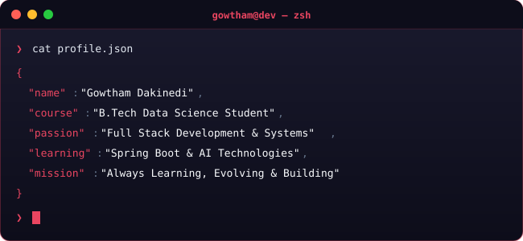

<p align="center">
  
</p>

<h1 align="center">Hey 👋 I'm Gowtham</h1>
<h3 align="center">FULL Stack Developer • Java Learner • Tech Explorer</h3>

---

## ◈ About Me

<p align="center">
  
</p>

> *"First, solve the problem. Then, write the code."*
<br/>

---

## ◈ Tech Stack

<div align="center">

**Backend**


**Frontend**


**Cloud & DevOps**


**Databases**


</div>

<br/>

---

## ◈ Connect

<div align="center">

[](https://linkedin.com/in/gowthamdakinedi)
&nbsp;
[](mailto:gowthamdakinedi@gmail.com)
&nbsp;
[](https://github.com/gowtham-178)
&nbsp;
[](https://leetcode.com/u/gowtham_178/)

</div>
<br/>

---

```text
  ◈  Built with Passion
```
